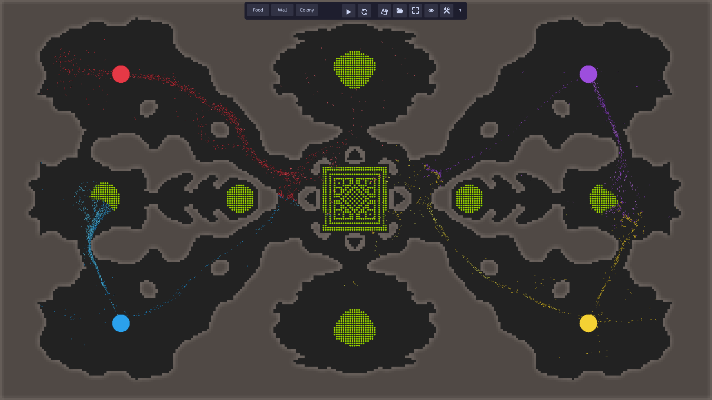
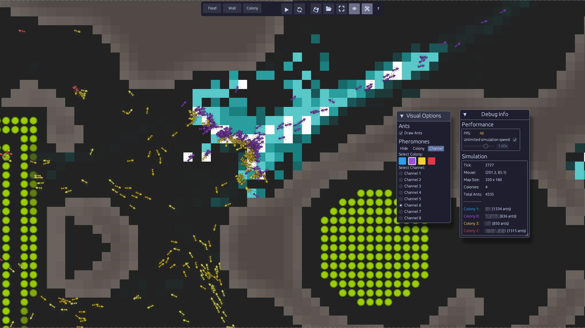

# Pherowar

**PheroWar** is an RTS game where you design the AI of an ant colony. Your goal is to program ants for efficient food gathering, returning resources to the nest, and defeating opposing colonies. Success depends on your AI's ability to guide the swarm through collective intelligence.

Gameplay relies on pheromones for coordinating **exploration**, **resource collection**, **defense**, and **offense**.

Each player's AI is a compiled `.so` library and run in an isolated container to ensure a safe and fair competitive environment.





## Prerequisites

- podman

## Installation

Build pherowar app:
```bash
./build.sh
```

This will build pherowar inside a podman container and create the player wrapper image. Only need to run this once.

## Usage

Run pherowar:
```bash
./pherowar.sh
```

## Documentation

[Game documentation](./player-doc.md)