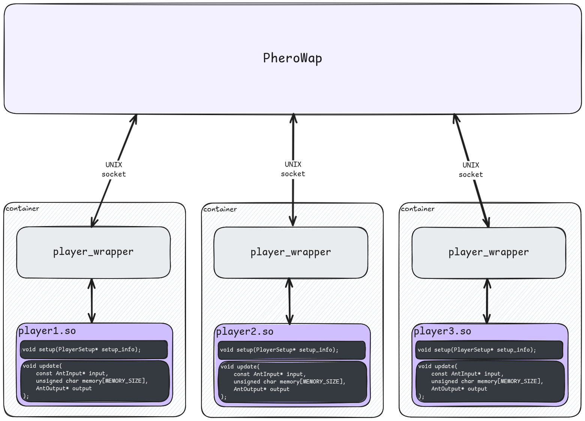

# PheroWar Player Documentation V1.1

## 1. Introduction
PheroWar is an RTS game where you design ant colony AI. Your goal is to program ants for efficient food gathering, returning it to the nest, and overcoming opposing colonies. Success depends on your AI guiding the ant swarm's collective intelligence. Gameplay uses pheromones for ant coordination in exploration, resource gathering, defense, and offense.

The PheroWar game application hosts the simulation. Each player's AI runs in an isolated container, executing a player process that loads your compiled AI (`<player>.so` shared library).



## 2. Getting Started: Your Player AI
Define your colony's AI in a `<your-colony-name>.so` loaded dynamically from the `./players/` folder everytime a colony is (re)placed on the map.

### The `<player>.so` Shared Library
The game engine communicates with `<player>.so` via a UNIX socket and a C ABI, calling specific functions (initialization, per-ant updates). You can create `player.so` using any language that compiles to a shared library with C-compatible functions (e.g., C, C++, Rust, Go, etc).

### Core AI Functions: `setup` and `update`
Implement these two functions in your `player.so`:

-   **`void setup(PlayerSetup* setup_info);`**
    -   **Purpose:** Called once when your AI is loaded, before simulation, for initial setup.
    -   **C API Signature:** `void setup(PlayerSetup* setup_info);`
    -   **Usage:** Modify the passed `PlayerSetup` struct (see Appendix) to configure pheromone channel decay rates.

-   **`void update(const AntInput* input, unsigned char memory[MEMORY_SIZE], AntOutput* output);`**
    -   **Purpose:** Core ant logic. Called for each ant every "think" tick. Decides the ant's action based on `input` and its `memory`, then writes to `output`.
    -   **What is a "think tick"?** A "think tick" is a discrete step in the simulation where an ant is allowed to process its inputs and decide on an action. It's not every simulation frame, but rather at a defined interval (`THINK_INTERVAL`) or when specific events occur (like entering a food patch or colony). This is when your `update` function is invoked for an ant.
    -   **When it's called:** Every `THINK_INTERVAL` (`1.5 / ANT_SPEED` seconds), or when an ant enters a food patch or its colony.
    -   **C API Signature:** `void update(const AntInput* input, unsigned char memory[MEMORY_SIZE], AntOutput* output);`
    -   **Usage:**
        -   `input`: Read-only `AntInput` struct (see Appendix) with ant state and sensory data.
        -   `memory`: A persistent `MEMORY_SIZE` byte array for this specific ant.
        -   `output`: An `AntOutput` struct (see Appendix) where you write the ant's desired actions.

## 3. Understanding the Game World

### 3.1. The Environment: A Grid-Based World
The world is a grid of cells, forming the basis for ant movement and sensing. Cells are terrain tiles that can only be of one type.

### 3.2. Map Elements
Cell types:
*   **Walls:** Impassable cells blocking movement and vision.
*   **Food:** Cells with depletable food amounts.
*   **Colony/Nest:** Home base for spawning new ants and returning food.

### 3.3. Coordinate System
Ant positions are 2D Cartesian coordinates (float). Integer parts determine the grid cell for world interactions.

### 3.4. Angles and Orientation
Ants have an orientation; senses provide info as angles relative to this.
*   **Representation:** Angles are in radians.
*   **Zero Direction:** 0 radians is directly forward of the ant.
*   **Angles:** π/2 radians (90°) is left; -π/2 radians (-90°) is right.
*   **Ant Senses Overview:**
    *   `wall_sense: (f32, f32)`: `(angle, distance)` to nearest visible wall.
    *   `food_sense: (f32, f32)`: `(angle, distance)` to nearest visible food.
    *   `colony_sense: (f32, f32)`: `(angle, distance)` to home colony.
    *   `enemy_sense: (f32, f32)`: `(angle, distance)` to nearest visible enemy.
    *   `pheromone_senses: [(f32, f32, f32); PHEROMONE_CHANNEL_COUNT]`: For each channel, `(angle, intensity)` to strongest pheromone.
    *   Most senses (`wall_sense`, `food_sense`, `enemy_sense`, `pheromone_senses`) operate in a forward cone (`SENSE_MAX_ANGLE` = π/4 rad each side, `SENSE_MAX_DISTANCE` = 10.0 cells). `colony_sense` is a direct sense (not limited to the forward arc) up to `SENSE_MAX_DISTANCE`.
*   **Ant Actions:**
    *   `turn_angle: f32`: Relative turn angle (radians). Positive for left, negative for right.

## 4. Ant Mechanics

### 4.1. Ant Spawning
Ants spawn automatically at the nest:
*   **Interval:** Every `ANT_SPAWN_INTERVAL` (0.3 seconds).
*   **Food Cost:** Requires `ANT_SPAWN_FOOD_COST` (5 units of food).
Spawns occur at the nest center with random rotation. Initial ant count is configurable in `config.toml`.

### 4.2. Ant Communication: Input and Output Structs

#### 4.2.1. `AntInput` Struct
Provides ant sensory data and state. See Appendix for C definition. Key information includes:
*   `is_carrying_food`, `is_on_colony`, `is_on_food`: Booleans for current status.
*   `pheromone_senses`: Per-channel angle and strength of the strongest signal in the ant's forward arc. Strengths up to `MAX_PHEROMONE_AMOUNT` (255.0).
*   `cell_sense`: Per-channel pheromone strength in the ant's current grid cell. Values up to `MAX_PHEROMONE_AMOUNT` (255.0).
*   `wall_sense`, `food_sense`, `enemy_sense`: Angle and distance to the nearest detected item in the forward arc. Distance is -1.0 if nothing is detected.
*   `colony_sense`: Angle and distance to the ant's own nest (direct sense). Distance is -1.0 if out of range or occluded.
*   `longevity`: Remaining lifespan, also serves as health.
*   `is_fighting`: Boolean, true if currently in combat.
Distances are in grid units. A distance of -1.0 indicates no target detected within range or line of sight.

#### 4.2.2. `AntOutput` Struct
Used by the `update` function to specify ant actions. See Appendix for C definition. Key information includes:
*   `turn_angle`: Desired turn angle in radians (positive is counter-clockwise/left).
*   `pheromone_amounts`: Array specifying how much pheromone to deposit on the current cell for each of the 8 channels (0.0 to `MAX_PHEROMONE_AMOUNT`).

### 4.3. Ant Memory
Each ant has `MEMORY_SIZE` (32 bytes) of persistent memory (`uint8_t memory[32]`), zero-initialized at spawn. Use this for internal state, multi-step tasks, or adaptive behavior.

## 5. Colony Management

### 5.1. Turn-by-Turn Logic
Each simulation tick processes colony and ant states/actions:
*   **Colony-Level Updates:** Pheromone decay, ant spawning, food collection.
*   **Ant-Level Updates:** Longevity decrease, `update` function call (if think timer ready), action processing.
*   **Order of Ant Processing:** The `update` call order for ants within your colony during a single tick is not guaranteed; design robust AI.

### 5.2. Ant Rejuvenation
Ant `longevity` (lifespan, starts at `MAX_ANT_LONGEVITY` = 300.0s) decreases over time. Restore longevity by:
1.  **Picking up food:** Restores full longevity.
2.  **Delivering food to nest:** Restores full longevity.
3.  **Winning a fight (dealing final blow):** Rejuvenates half of the longevity lost up to that point. No rejuvenation if the opponent dies from other causes.

## 6. Advanced Systems

### 6.1. Pheromones
Pheromones are the primary indirect communication system: chemical trails influencing same-colony ants.

#### 6.1.1. Purpose and Mechanics
Ants deposit and sense pheromones on grid cells. Uses include:
*   Marking paths to food.
*   Signaling danger.
*   Coordinating exploration.
*   Guiding ants to the nest.
*   Whatever you can think of.

#### 6.1.2. Pheromone Channels
`PHEROMONE_CHANNEL_COUNT` (8) independent channels (different "scents").
*   **Independent Usage:** Channels are separate; no mixing.
*   **Strategic Flexibility:** Assign different meanings (e.g., Channel 0: "Path to Food", Channel 1: "Danger").
*   **Sensing and Laying:**
    *   `AntInput`'s `pheromone_senses` provides the strongest signal (angle, intensity) per channel.
    *   `AntOutput`'s `pheromone_amounts` specifies deposit amount per channel (0.0 to `MAX_PHEROMONE_AMOUNT` = 255.0). The maximum pheromone on a cell for a channel is `MAX_PHEROMONE_AMOUNT`.

#### 6.1.3. Pheromone Decay Rates
Pheromones fade over time (decay).
*   **Configuration:** Configure decay rate per channel in `setup` via `PlayerSetup`'s `decay_rates[8]`.
*   **Decay Mechanics:** `decay_rates` values are the fraction of pheromone strength remaining after 1 second (e.g., 0.95 means 95% remains). Decay is applied every `PHEROMONE_DECAY_INTERVAL` (1.0 second).
*   **Strategy:** Choose rates based on information type (fast decay for temporary signals, slow for persistent trails).

### 6.2. Combat System
Direct conflict between ants of different colonies is also a key part of the game.

#### 6.2.1. Engaging in Combat
*   **Signaling Intent:** Signal to initiate a fight by setting `try_attack` field in `AntOutput` to `true`.
*   **Initiating a Fight:** If `try_attack` was true on the previous tick and the ant is not fighting, the simulation checks for an enemy in the same cell or recently sensed and in reach to initiate a fight.
*   **Being Attacked:** Ants can be attacked by enemy AI even if `try_attack` was set to `false`.
*   **Sensing Enemies:** `AntInput` provides `enemy_sense[2]` (angle, distance) and `is_fighting` (boolean).
*   **Fighting State:** Once engaged (`is_fighting` is true), an ant auto-faces and attacks its opponent. While fighting, an ant cannot move or turn but can still lay pheromones. Ants can not desengage from combat until the fight is resolved (one ant dies).
*   **Fight Brawle:** Multiple ants can fight simultaneously. Each ant keeps a list of enemies it is currently fighting. When one of them dies, the ant will automatically switch to the next enemy in its list.

#### 6.2.2. Damage and Longevity (Health)
`longevity` also serves as health in combat.
*   **Taking Damage:** When hit, an ant takes `ANT_ATTACK_DAMAGE` (5.0), subtracted from its `longevity`.
*   **Death:** If `longevity` drops to 0.0 or below, the ant dies. If carrying food, it's dropped on the cell.
*   **Rewards for Victory:** An ant defeating an enemy (dealing the final blow) rejuvenates half of its previously lost longevity.

## 7. Winning the Game
Objective: Be the last colony standing. Win by eliminating all other colonies (e.g., colony loses all ants).

## 8. Configuration and Constants

### 8.1. Game Configuration (`config.toml`)
Configure game parameters in `config.toml` (root directory). Key parameters:
-   `colony_initial_population = <number>`: Starting ants per colony.
-   `map = "<map_filename>.map"`: Default map file.
-   `players_dir = "<path>"`: Directory for player AI `.so` files.
-   `maps_dir = "<path>"`: Directory for map files.

### 8.2. Important Game Constants
Hardcoded simulation constants (defined in `PheroWar/pherowar/src/simulation/mod.rs`):
-   **Sensing:**
    -   `SENSE_MAX_DISTANCE = 10.0` (units)
    -   `SENSE_MAX_ANGLE = std::f32::consts::FRAC_PI_4` (π/4 radians or 45 degrees per side)
-   **Movement & Actions:**
    -   `ANT_SPEED = 4.0` (units/second)
    -   `THINK_INTERVAL = 1.5 / ANT_SPEED` (seconds)
-   **Combat & Health:**
    -   `MAX_ANT_LONGEVITY = 300.0` (seconds, also max health)
    -   `ANT_ATTACK_DAMAGE = 5.0`
-   **Colony & Spawning:**
    -   `ANT_SPAWN_INTERVAL = 0.3` (seconds)
    -   `ANT_SPAWN_FOOD_COST = 5` (food units)
-   **Pheromones:**
    -   `PHEROMONE_CHANNEL_COUNT = 8`
    -   `MAX_PHEROMONE_AMOUNT = 255.0` (max strength on a cell / max deposit per tick)
    -   `PHEROMONE_DECAY_INTERVAL = 1.0` (second)
-   **Ant Memory:**
    -   `MEMORY_SIZE = 32` (bytes)

## 9. Development Tools

### 9.1. The PheroWar Editor
PheroWar includes a built-in map editor for creating and modifying game maps, designing scenarios, and testing ant behaviors.
Features:
-   Place/remove Walls, Food sources, Colony Nests.
-   Save and load maps.
-   Debugging tools (visualize pheromones, ant states, etc.).
The in-game help button (top right of editor) shows keybindings.

### 9.2. Logging
Your container's standard output (`stdout`) is redirected to log files. Each player colony's output is saved in a separate file named `Application/player_X.log`, where `X` is the colony ID (an integer, e.g., `player_0.log`, `player_1.log`). This is useful for debugging your AI logic.

## Appendix: C API Reference
This appendix details the C Application Binary Interface (ABI) for your `<player>.so` shared library.

-   **`void setup(PlayerSetup* setup_info);`**
    -   Called once at game start per colony.
    -   For initial settings (e.g., pheromone decay rates).
    -   `setup_info`: Modifiable `PlayerSetup*`.

-   **`void update(const AntInput* input, unsigned char memory[MEMORY_SIZE], AntOutput* output);`**
    -   Called repeatedly per ant.
    -   Core ant decision logic.
    -   `input`: `const AntInput*` (sensory data).
    -   `memory`: `unsigned char memory[MEMORY_SIZE]` (persistent ant memory).
    -   `output`: `AntOutput*` (ant actions).

-   **`AntInput` Struct Definition**
    ```c
    typedef struct {
        bool is_carrying_food;
        bool is_on_colony;
        bool is_on_food;

        float pheromone_senses[8][2]; // [0]: angle, [1]: strength
        float cell_sense[8];

        float wall_sense[2];          // [0]: angle, [1]: distance
        float food_sense[2];          // [0]: angle, [1]: distance
        float colony_sense[2];        // [0]: angle, [1]: distance
        float enemy_sense[2];         // [0]: angle, [1]: distance

        float longevity;
        bool is_fighting;
    } AntInput;
    ```

-   **`AntOutput` Struct Definition**
    ```c
    typedef struct {
        float turn_angle;
        float pheromone_amounts[8];
    } AntOutput;
    ```

-   **`PlayerSetup` Struct Definition**
    ```c
    #define PHEROMONE_CHANNEL_COUNT 8

    typedef struct {
        float decay_rates[PHEROMONE_CHANNEL_COUNT];
    } PlayerSetup;
    ```

-   **Constants:**
    -   `MEMORY_SIZE = 32` (bytes)
    -   `PHEROMONE_CHANNEL_COUNT = 8`
    -   `MAX_SENSE_DISTANCE = 10.0` (units)

Ensure your shared library correctly exports `setup` and `update` functions with these exact signatures and uses these struct definitions.
